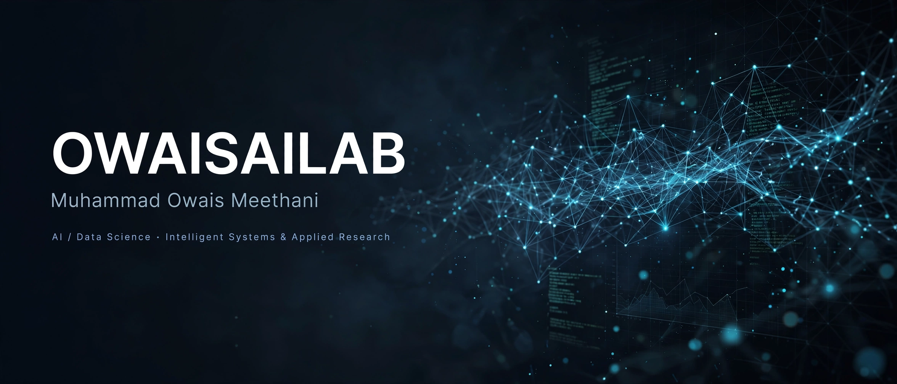
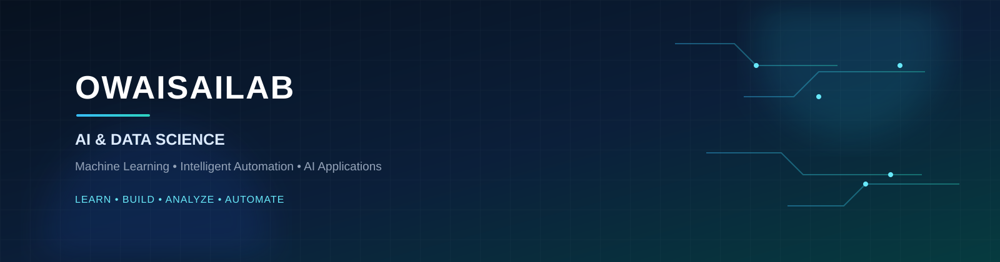

<!-- ========================= HERO ========================= -->

  

 
   
   
   
   

 

 
   

## About Me
I am an **AI & Data Science builder** focused on turning data and real-world problems into practical, production-ready software.

My work sits at the intersection of **Data Analysis, Machine Learning, AI Applications, Backend Development, and Intelligent Automation**.

Currently progressing from classical ML and deep data analysis toward **Deep Learning, LLM Applications, RAG, and Agentic AI**.

> **My approach:** Understand → Analyze → Build → Evaluate → Improve

## What I Build
<table> 
  <tr> 
    <td width="50%" valign="top">

### Data & Machine Learning
- Exploratory Data Analysis & Visualization
- Data Cleaning & Preprocessing
- Feature Engineering
- Supervised Learning (Regression & Classification)
- Model Evaluation & Selection
- Time-Series Forecasting
</td> 
    <td width="50%" valign="top">

### AI & Intelligent Systems
- AI-powered Applications
- LLM-based Workflows
- RAG Applications
- Intelligent Automation
- AI Assistants & Agents
- Agentic AI
- AI-driven Data Analysis
</td> 
</tr> 
</table>

---

## Technology Stack

### Core 

  

### Application Development

  

### AI & Automation

  
  
  
  
  

---

## Featured Work
### TracePass — Digital Product Passport
A Flask-based **Digital Product Passport** platform focused on product identity, authenticity, traceability, certifications, and QR-based verification.
 Flask SQLAlchemy PostgreSQL QR Codes Auth Reporting

### CDR Intelligence Portal
Intelligence-oriented app for processing and analyzing **Call Detail Records**, surfacing meaningful patterns from large-scale telecom datasets.
 Flask Pandas SQLite Data Analysis Intelligence Workflows

### Rental Housing Society Management
A Flask-based **Housing Society** that manage record of the entire society from construction to monthly rent.

### Training Examination Management System
Online examination platform with **controlled question management, randomized assessments, automated evaluation, and transparent workflows**.
 Python Flask Database Systems Automation

### Used Car Sales Price Predictor
A car owner enter his car details and system tells his expected resale price.

### Machine Learning & Data Science Lab
A growing collection of practical ML work:

- Gold Price Forecasting
- Housing Price Analysis
- Regression & Classification Model Comparison
- EDA, Feature Engineering & Preprocessing

---

### Learning Path

**Pandas & Data Analysis**
→ **Machine Learning**
→ **Deep Learning**
→ **LLM Applications**
→ **RAG**
→ **Agentic AI**

### Current Focus:

- Advanced Pandas & Data Analysis
- Supervised ML & Model Evaluation
- Time-Series Prediction
- Deep Learning Fundamentals
- Large Language Models & RAG
- Agentic AI & AI Automation

---

## GitHub Activity

 
   

   

 

 
   

## Development Philosophy
<table>
<tr>
<td align="center" width="25%">

**01**

Understand

</td>
<td align="center" width="25%">

**02**

Analyze

</td>
<td align="center" width="25%">

**03**

Build

</td>
<td align="center" width="25%">

**04**

Improve

</td>
</tr>
</table>

Deep dive into the real problem	Explore data for patterns & signals	Build useful, deployable systems	Evaluate, iterate, and harden

I prefer building **useful systems over isolated demos**. Every project is an opportunity to understand a problem more deeply and ship something that works in a real environment.

---

## Connect

 
   <!-- Add your LinkedIn / Portfolio links here --> <!--  --> 

 

 
  AI & Data Science · Machine Learning · Automation · Agentic AI
    
  <b>Learn. Build. Analyze. Automate.</b> 

  

